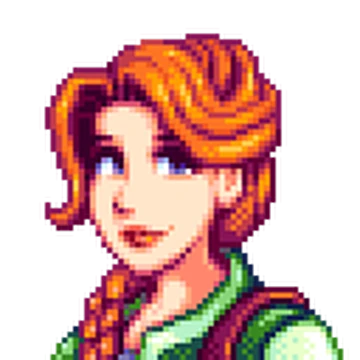
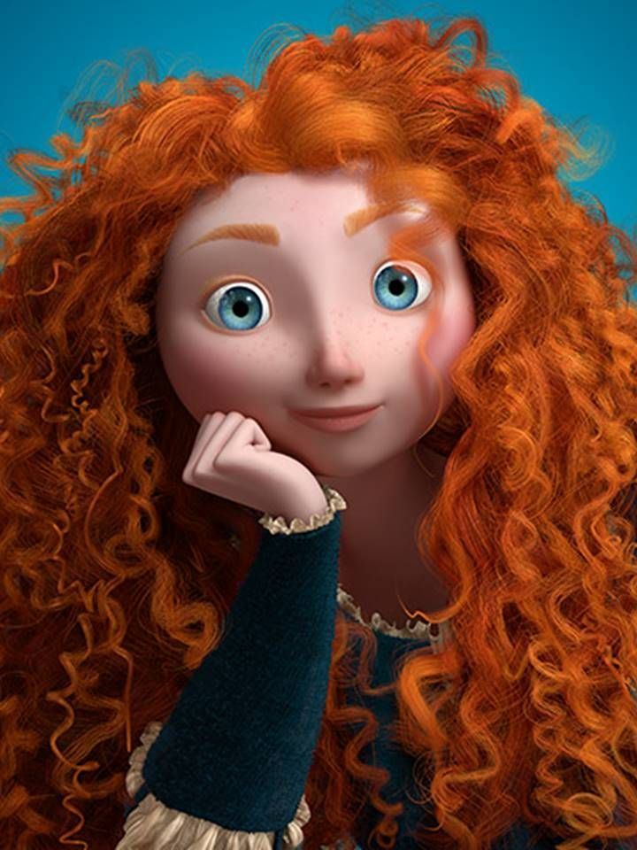
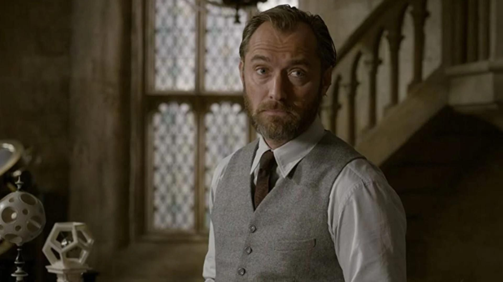

<!DOCTYPE html> 
<html lang="pt-br">
<head>
    <meta charset="UTF-8">
    <title>Portfolio de site, exemplo: Stardew Valley</title>
    <link rel="stylesheet" href="style.css">
</head>
<body>
    <header>
        <h1>Stardew Valley - Personagens favoritos e como os relaciono 🌻</h1>
        
Os melhores personagens de Stardew Valley (Baseado na minha opinião)

    </header>

    <section>
        <h2>1° Personagem favorito: Sebastian</h2>

        

        
Ele é um verdadeiro emo introvertido, mora no porão da casa de sua mãe e seu padrasto. É o meio-irmão mais velho da Maru. Costuma dizer que sua irmã tem toda a atenção da casa, enquanto ele é abandonado. É viciado em jogos, HQ, ficção científica, às vezes programa e o seu maior hobby é ficar sozinho no quarto.

        
Sebastian ama lágrima congelada, obsidiana, ovo de sapo, ovo nulo, sashimi e sopa de abóbora. Ele curte café, o peixe linguado, maçãs, pêssego, pizza, bolo de chocolate... em geral, tem um paladar infantil e adorável. 
            Mora nas montanhas, ao norte da vila dos Pelicanos, costuma sair mais quando está chovendo ou à noite, tal qual o Edward Cullen.

        
    </section>

    <section>
        <h2>2° Personagem favorito: Leah</h2>

        
        
Essa fofa mora em uma cabana pequena fora da cidade. Fica esculpindo suas lindas e "cirúrgicas" estátuas, por assim dizer. Ela e o Elliot são os únicos que trancam suas casas (Errados não estão né gente...).
             Essa moça linda também veio da cidade para o vale e durante os eventos de coração, seu ex Kel é citado. 
            Ama bolinho de papoula, mexido de legumes, queijo de cabra, refogado, salada, trufa e vinho. Também gosta de alho poró, avelã, azevinho, cantarelo, ceboinha e cogumelos. Em geral, uma querida, não gosta de rivalidade feminina e é super amiga.
 

        
Me lembra a Merida...
    

        
    </section>

    <section>
        <h2>3° Personagem favorito: Harvey</h2>

        

        
Esse é o Harvey ou Dr. Harvey, as pessoas da vila costumam falar que ele é velho mas na verdade ele é maduro e é um cara muito amável, apesar de introvertido. Mora em cima da sua clínica e vive trabalhando. Ele é bastante pilhado com a saúde da população.

        
        
A Maru trabalha com ele e as vezes os dois tem conversas que podem causar ciúmes dependendo da sua escolha de casável. Ama Café (feliz no simples?), óleo de trufas, picles (por Deus...), superprato e um bom vinho, mas afinal, quem não gosta de um bom vinho?!

        
Se Dumbledore estivesse em um universo paralelo, onde ele deixaria de ser um professor comunicativo, pra um médico introvertido e paranoico, com toda certeza seria o Harveyzinho.

        
    </section>

<audio autoplay loop muted>
    <source src="audio/Ghosts.mp3" type="audio/mpeg">
</audio>

</body>

</html>
